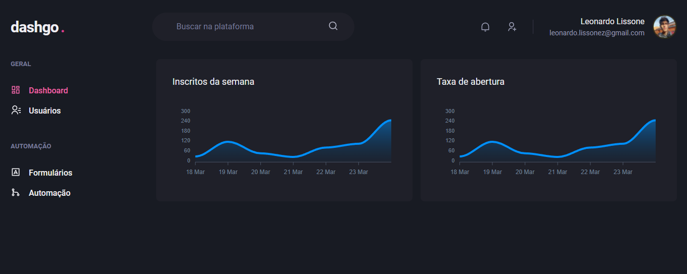

<h1 align="center">
  DashGo
</h1>

<p align="center">
  <a href="#description">Description</a>&nbsp;&nbsp;&nbsp;|&nbsp;&nbsp;&nbsp;
  <a href="#requirements">Requirements</a>&nbsp;&nbsp;&nbsp;|&nbsp;&nbsp;&nbsp;
  <a href="#technologies">Technologies</a>&nbsp;&nbsp;&nbsp;|&nbsp;&nbsp;&nbsp;
  <a href="#usage">Usage</a>&nbsp;&nbsp;&nbsp;|&nbsp;&nbsp;&nbsp;
  <a href="#demonstration">Demonstration</a>
</p>
<br />
<p align="center">
  
  
  
  
  
  
  
</p>

<p align="center">
  <a href="https://github.com/Lissone/dashgo/issues">Report bug</a>
  ·
  <a href="https://github.com/Lissone/dashgo/issues">Request feature</a>
</p>

<br />

## Description

An administration and monitoring site, with dashboard. The project was developed as an incentive to learn and improve myself more in the subject of declarative interface using Chakra UI, and to know new data fetching libraries (React query), dashboard charts (Apex charts), fake api (MirageJs), bulk random data generator (Faker) and form controllers (React hook form).

## Requirements

* [Yarn](https://yarnpkg.com/)
* [Nodejs](https://nodejs.org/en/)

## Technologies

* ReactJs
* NextJs
* Typescript
* Chakra UI
* Apex Charts
* React hook form
* React query
* MirageJs (fake api)

## Usage

You can use this project as a template for another one, or clone it on your pc using the command:

```bash
git clone https://github.com/Lissone/dashgo.git
cd dashgo
```

Install dependencies using:
```bash
yarn
#or
npm run
```

Run application:
```bash
yarn dev
#or
npm run dev
```

## Demonstration



## License

Distributed under the MIT License. See `LICENSE` for more information.

<h4 align="center">
  Made with ❤️ by <a href="https://github.com/Lissone" target="_blank">Lissone</a>
</h4>

<hr />
